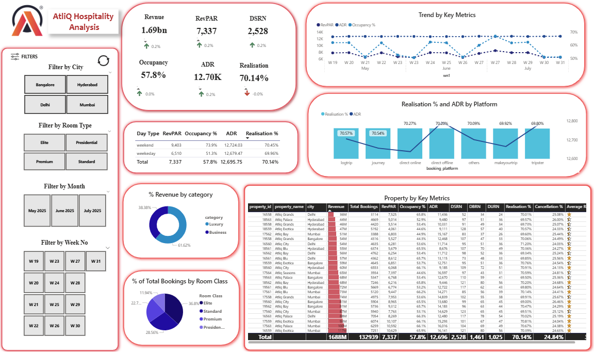
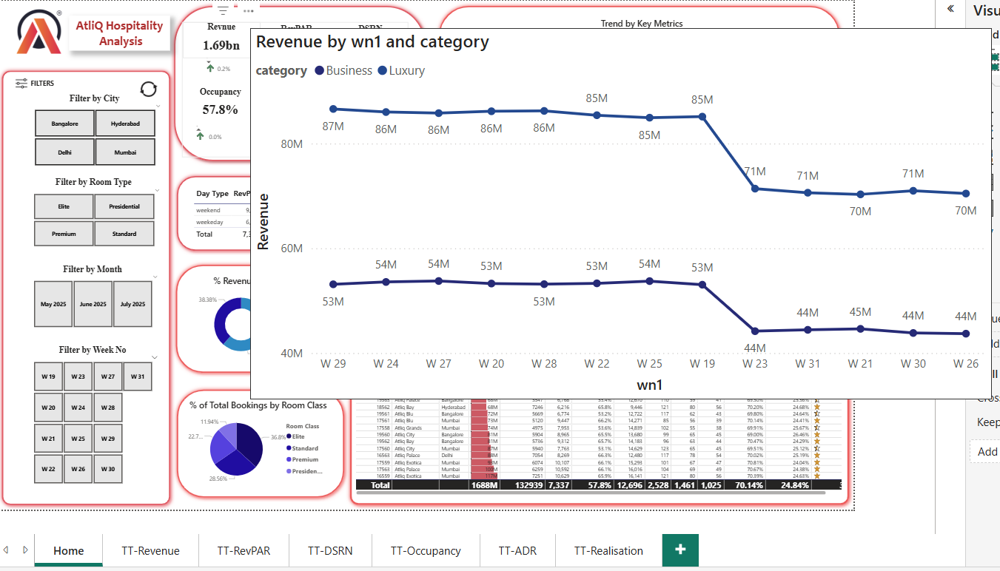

# AtliQ Hospitality Analysis Dashboard

This project is my third data analysis project and my first using Power BI as a fresh graduate. The goal was to develop a fully interactive business intelligence dashboard that provides key insights into hotel operations, customer behavior, and booking performance for AtliQ Hospitality — a hotel chain operating across major cities in India.

## Project Objective

To build a data-driven dashboard that supports hotel management in:

- Monitoring performance across different cities and hotel categories
- Understanding booking behavior by platform, room type, and time period
- Tracking key financial and operational metrics
- Identifying trends and opportunities to increase efficiency and revenue

## Key Insights Displayed

- **Revenue Metrics**: Total Revenue, ADR (Average Daily Rate), RevPAR (Revenue per Available Room)
- **Operational Performance**: Occupancy Rate, DSRN (Daily Successful Room Nights), Realisation Percentage
- **Hotel Comparison**: Business vs Luxury category performance
- **Room Type Analysis**: Standard, Elite, Premium, and Presidential
- **Booking Behavior**: Weekday vs Weekend patterns, monthly and weekly trends
- **Platform Analysis**: Revenue and efficiency of platforms like MakeMyTrip, Direct Online, Journey, etc.

## Tools and Techniques Used

- **Power BI**: Data modeling, KPI calculation, and dashboard creation
- **DAX**: Measures for occupancy, RevPAR, realisation %, etc.

- **Data Modeling**: Relationships across five datasets (CSV format)
- **Interactive Features**: Filters for city, hotel, room category, date, and platform
- **Visualizations**: KPI cards, line charts, bar graphs, pie charts, and tables
